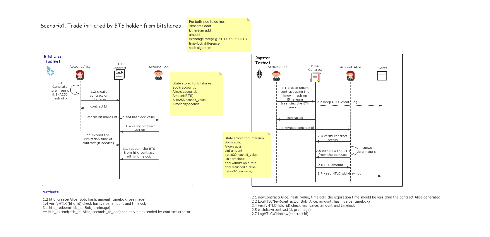
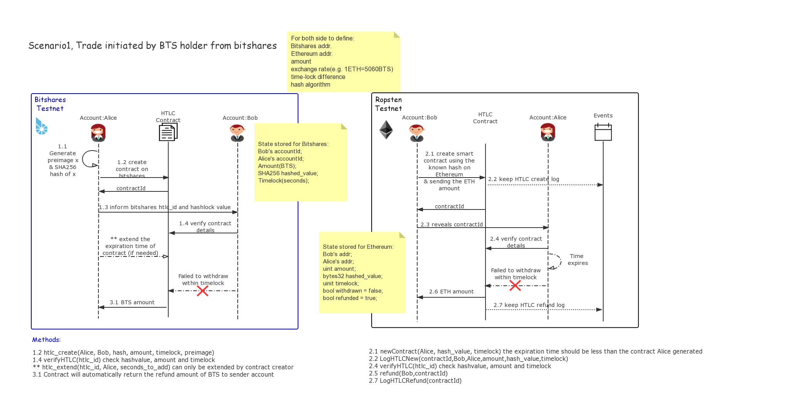

# BTS-ETH-atomic_swaps

Simple Nodejs HTLC implementation for doing cross-chain atomic swaps between Bitshares and Ethereum.

In this code version, the blockchain network server for Bitshares is built locally, and Ethereum is using Ropsten Testnet and MetaMask wallet to prepare the accounts. 

## Develop

### Start Bitshares private testnet

```bash
cd bitshares-core/testnet_local/
./witness_node --data-dir data/my-blocktestnet --enable-stale-production --seed-nodes "[]"
```
*NOTE*: If you haven’t build your own private testnet please follow the official tutorial: [Private Testnet Setup](https://dev.bitshares.works/en/master/development/testnets/private_testnet.html#initial-compilation)

### Check your Metamask wallet balance

Please check the balance of your transfer account before using, the first account id, in this case, is 0, and so on.
You could get Ether for test only through a faucet for the Ropsten [here](https://faucet.metamask.io/)

### Run program

```bash
npm run test
```

### Scenario Sequence Diagram



#### Summary

- Alice is selling BTS to Bob
- Bob is selling ETH to Alice
- Alice initiates the trade and generating the secret `preimage x` (preferable >= 31 length)
- Alice creates a new HTLC on the Bitshares with the hashed_preimage
- Bob creates a new HTLC on the Ethereum HTLC contract to hold the ETH using the hash value
- Alice claims ETH revealing `x` to the HTLC contract on Ethereum
- Bob takes the revealed `x` and claims BTS from the Bitshares HTLC contract

#### Steps

1. Agreement: 

   a. Both parties should define the exchange rate and agree on the transaction amount

   b. Both parties should agreed on the hash algorithm (e.g.SHA256)

   c. Both parties should know counter one’s address/id

2. Contract:

   a. Alice generates the preimage secret `x`
   b. (Bitshares) Alice initiates the contract with contract details and gets the HTLC id

   ``` yaml
   Enter BTS account name of sender: Alice
   Enter BTS account name of recipient: Bob
   Enter BTS amount to send: agreed_amount
   To log contract uniformly,
   we highly recommended generating secret should be no shorter than 32!
   Enter the preimage value you generate: $My_Generated_Preimage_Value_X_$
   Enter the time you want to lock in contract (seconds): 3600
   
   Deploying...
   ```

   *NOTE*:

   Here I specify the length of preimage should be no shorter than 32, that is because of the `bytes32` format using in solidity contract creation. Wrong length of preimage will cause the contract reverted by EVM, see below:

   ``` json
   Error: Transaction has been reverted by the EVM:
   {
   "blockHash": "0x5527aacc2c64e344007b3e607791c42b2580c78d2546a4851174c1bd79033791",
   "blockNumber": 6138086,
   "contractAddress": null,
   "cumulativeGasUsed": 3287976,
   "from": "0x209f4b189e246ae171da5a6f1815c91c70caa23a",
   "gasUsed": 27327,
   "logsBloom":    "0x00000000000000000000000000000000000000000000000000000000000000000000000000000000000000000000000000000000000000000000000000000000000000000000000000000000000000000000000000000000000000000000000000000000000000000000000000000000000000000000000000000000000000000000000000000000000000000000000000000000000000000000000000000000000000000000000000000000000000000000000000000000000000000000000000000000000000000000000000000000000000000000000000000000000000000000000000000000000000000000000000000000000000000000000000000000",
   "status": false,
   "to": "0x243785f6b65418191ea20b45fde7069ffe4f8cef",
   "transactionHash": "0x8a141c64dc103beef44aaaa9aae9cffec502d7d7ac8848a95a4d006a64ae89f4",
   "transactionIndex": 15,
   "events": {}
   }
   ```
   
  In solidity language, using `sha256(...)` will require tightly packed arguments, thus, `abi.encodePacked(...)` is applied, this packed algorithm will not treat types shorter than 32 bytes with either zero padded or sign extended. So the preimage should have length limit. [see here](https://solidity.readthedocs.io/en/v0.4.24/abi-spec.html#abi-packed-mode)
   

   c. (Bitshares) Alice informs Bob with the hash value and HTLC id

   ``` yaml
   Please inform your counter party with the hash value: _some_hash_value_
   and BTS HTLC id: 1.16.xxx
   ```

   

   d. (Ethereum) Bob calls `newContract` with the know hash value and gets the HTLC id

   ``` yaml
   Enter your sender account id of ETH wallet(e.g. firstAcc is 0): 0
   > Ropsten ETH wallet address = Bob_account_address
   Enter ETH address to receive funds: Alice_account_address
   Enter the ETH you want to send: agreed_amount
   Enter the hash_value you got from BTS side: _same_hash_value_
   To protect your money, please lock the contract less time than BTS does...
   Enter the time you want to lock in contract (seconds): 1800
   
   Deploying...
   ```

   

   e. (Ethereum) Bob informs Alice with the HTLC id

   ``` yaml
   Please inform your counterparty with the ETH HTLC id: eth_htlc_contract_id
   ```

   

3. Verify:

   a. Bob verifies the contract details (BTS)

   ```yaml
   Enter your BTS account name: Bob
   Enter the BTS HTLC id: 1.16.xxx
   BTS HTLC:
   From Account id         | 1.2.xx (Alice id)
   To Account id           | 1.2.xx (Bob id)
   Transaction amount      | agreed_amount BTS
   Hash value              | _some_hash_value
   Expiration time         | 2019-08-05T14:24:10
   ```
   b. Alice verifies the contract details (ETH)

   ``` yaml
   Enter your recipient account id of ETH wallet: 1
   Ropsten ETH wallet address = Alice_account_address
   Enter the ETH HTLC id: eth_htlc_contract_id
   
   ETH HTLC:
   Sender          | Bob_account_address
   Reciever        | Alice_account_address
   Transfer amount | agreed_amount_but_in_wei Wei
   Hash value      | _same_hash_value
   Unlock time     | Mon Aug 05 2019 14:19:43 GMT+0200 (GMT+02:00) (~ 4 mins)
   ```
   
4. Trade:

   a. (Ethereum) Alice calls `withdraw` to claim ETH using preimage `x` she knows, reveals `x`

   ``` yaml
   Enter yes if you want to redeem the agreed amount of ETH from contract: 
   eth_htlc_contract_id
   Or enter exit if you want to quit:
   > yes
   Resolving ETH HTLC...
   ```

   If the hashlock and timelock requirement checks out, then redeem successfully, showing the redeemed time and the balance of Bob account

   ``` yaml
   ETH HashTimelockContract was successfully redeemed!
   Account: Alice_account_address has balance of _new_balance_ ETH
   ```
   
   
   
   b. (Bitshares) Bob gets the secret and calls withdraw to redeem BTS.
   
   c. (Ethereum) Bob calls the `waitForHTLC` function to wait for Alice claim the ETH and reveals preimage
   
   ``` yaml
   If details are correct then input yes to redeem your BTS
   Or else please enter exit and talk with your counter party: 
   > yes
   Waiting for ETH contract to be resolved...
   ```
   
   If the hashlock and timelock requirement checks out, then redeem successfully, showing the after balance of Alice account
   
   ``` yaml
   Resolving BTS HTLC contract...
   BTS HashTimelockContract was successfully redeemed at : Mon Aug 05 2019 14:22:04 GMT+0200 (GMT+02:00) 
   Account Balance is _new_balance_ BTS  
   ```

   

### Failed transaction



If Alice failed to redeem the ETH from contract before contract timelock expires, then when timelock passed, Bob could get the refund ETH from contract by calling `refund` function with correct contract ID

``` yaml
Waiting for ETH contract to be resolved...
ETH HTLC timed out
Refunding ETH...

ETH HashTimelockContract was successfully refunded!
Account: Bob_account_address has balance of _original_balance_ ETH
```

Then after the timelock expires on BTS side, the locked BTS will return to Alice automatically as well.

*NOTE*:

We also provide Alice with the ability to extend the timelock of her contract by calling `extendHTLC` function:

``` yaml
Enter your BTS account name: Alice
Enter BTS HTLC_id you want to extend: 1.16.xxx
Enter the extra time you need for contract (in seconds): 300

BTS HashTimelockContract was successfully extended!
Please redeem the contract before: 2019-08-05T14:30:10
```


**Important:**

This atomic swaps can only be initiated by Bitshares since to deploy BTS HTLC will need the preimage clarified. Will keep updated with official HTLC operation and implement the scenario when ETH initiated the swap...
